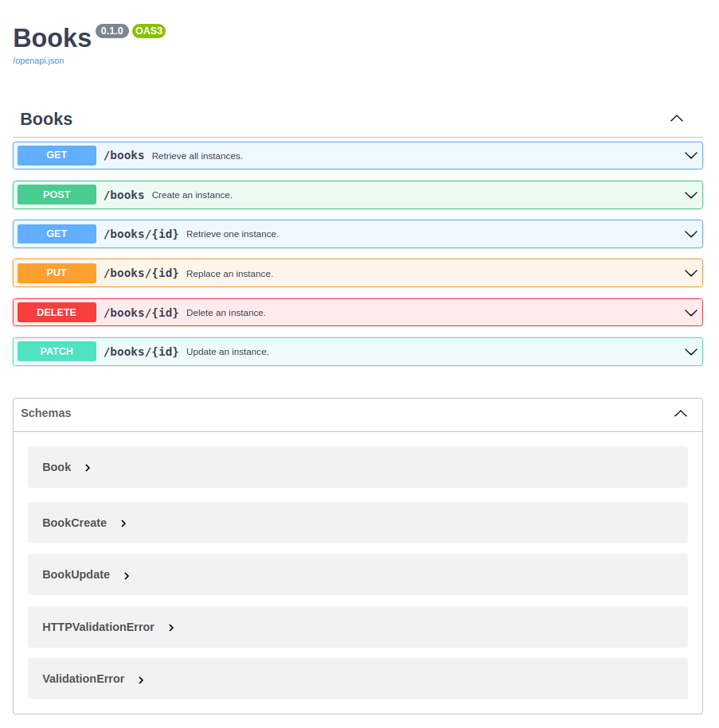

# CrudAPI: The easiest way to create your CRUD APIs

[](https://codecov.io/gh/unmateo/crudapi)
[](https://github.com/psf/black)
[](https://badge.fury.io/py/crudapi)

Combining the power of [FastAPI](https://fastapi.tiangolo.com/) and [SQLModel](https://sqlmodel.tiangolo.com/), you'll only have to care about modeling your data and we'll take care of building up a RESTful API for it.

```python
from typing import Optional

from sqlmodel import Field
from sqlmodel import SQLModel

from crudapi.api import CrudAPI
from crudapi.models.base import BaseModel


class BookUpdate(SQLModel, table=False):

    description: Optional[str] = Field(nullable=True)
    review: Optional[str] = Field(nullable=True)


class BookCreate(BookUpdate):

    title: str = Field(nullable=False)


class Book(BookCreate, BaseModel, table=True):

    __tablename__ = "books"


crud =  CrudAPI(
    orm_model=Book,
    response_model=Book,
    create_model=BookCreate,
    update_model=BookUpdate,
    title="Books",
)
```

you'll get, out of the box, a working _crudapi_ with all these working REST endpoints:

- GET: /books
- POST: /books
- GET: /books/\<id>
- PATCH: /books/\<id>
- PUT: /books/\<id>
- DELETE: /books/\<id>

and because CrudAPI subclasses FastAPI you'll also get all the incredible features of this wonderful library, including automatic OpenAPI schema generation and a working [SwaggerUI](https://swagger.io/tools/swagger-ui/):



---

## Development

We use Poetry for packaging and dependency management:

`poetry install`

`poetry shell`

We use Pytest for testing:

`pytest`

You can start a testing server running:

`uvicorn tests.server:app --reload `

## Acknowledgments

This wouldn't be possible without the great people working in the following open source projects. Eternal thanks to all of them.

- [SQLAlchemy](https://www.sqlalchemy.org/) _"The database toolkit for python."_
- [Starlette](https://www.starlette.io/) _"The little ASGI framework that shines."_
- [pydantic](https://pydantic-docs.helpmanual.io/) _"Data validation and settings management using Python type hinting."_
- [FastAPI](https://fastapi.tiangolo.com/) _"FastAPI framework, high performance, easy to learn, fast to code, ready for production."_
- [SQLModel](https://sqlmodel.tiangolo.com/) _"SQLModel, SQL databases in Python, designed for simplicity, compatibility, and robustness."_
